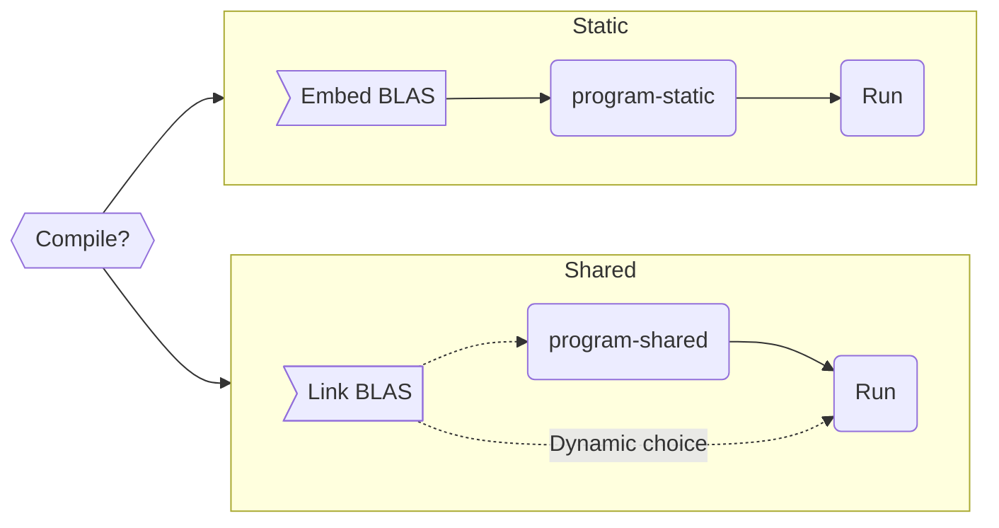

# Linking compiled programs

Compiled programs encompass any code that is required to be *compiled*
to machine readable code, before it can be executed.

Some examples of compiled codes are:

- Fortran
- C / C++
- Rust
- Nim
- many more ...

Any user of these *compiled* programs must first install a compiler for said
language. This compiler is in charge of converting the code semantics to
machine-readable instructions.


## Dynamic or Static?

A user of a program will compile programs to make them *executable* (run the programs).
All programs you are using on your computers have likely been compiled at some point in
time, and they are generally using *dynamic* linking (also known as shared linking).

The difference between static and dynamic linking can be explained with an analogy of how
person A shares a document to person B.

- Static  
  Person A will send the document to person B (e.g. as an attachment in emails)

- Dynamic  
  Person A will send a link to the document to person B (e.g. person B does not *have* the
  document).
  In code-terms, we call this *shared* linking.

The difference in this case is obvious. When sharing a link, person A has the possibility
of updating the document, without having to resend it to person B. Additionally there
is no duplication of data. The document only lives *one place*.
However, if person A accidentally deletes the document, then it will be lost, and the context
in which the document was used will be lost.  
With static linking one ensures that person B has complete knowledge at the time
of receiving the document. This at the cost of having to request a new document if it
changes, and at the cost of duplicating data.

The same applies to dynamic vs. static linking of programs. Therefore programs are
frequently (if not always) relying on dynamic linking. Consider for instance your Outlook
program. This program relies on some calls to the operating system (to show the graphical
user interface). These calls to the operating system are *dynamically* resolved when
needed.
Hence, if your operating system requires an update (bug fixes, etc.) then
Outlook will automatically pick up these changes since the calls to the operating
system happen *dynamically*. If it was linked statically, then any update to the operating
system, would mean that Outlook would not see the benefit of those updates, because
it is self-contained with the information.


The flow-chart of these two methods can be shown like this:



## Compiling the programs

The program here is very simple.
It calls a BLAS function called `sgemm` (single precision matrix multiplication).
By executing:
```shell
module load gcc/13.2.0-binutils-2.41 openblas/0.3.27
make FC=gfortran BLAS_PATH=$MODULE_OPENBLAS_LIB_DIR
```
this will compile 1 or 2 programs in the same directory:
```
program-static  # maybe, depends on available libraries
program-shared  # should always be compiled
```
The `program-static` program resolves the BLAS call at compile time, and thus the method is
statically linked in the program (read: distributed with the executable).  
The `program-shared` program resolves the BLAS call at run time, and thus the underlying
method can be changed by the user before executing the program.


## Running the programs

In this case there are two programs, the statically linked one is *permanent*, i.e. the
end user does not have any control of its internal function calls; all is deterministic.

The static one is simple:
```shell
./program-static
```
you will not see any output (on purpose).

The second case lets the user have control of what BLAS library it should use:
```shell
./program-shared
 Running simple program calling BLAS sgemm
 Done
```
So, there is a default library (the one linked too at compile time)!

However, let's *dynamically* replace the call to the BLAS library, we have a custom
library placed in `lib/`, so we can tell the program to pick that up instead:
```shell
LD_LIBRARY_PATH=./lib ./program-shared
 Running simple program calling BLAS sgemm
 Calling sgemm from my library!
 Done
```

The dynamic linking of external libraries provides greater flexibility, as long as the
API is the same.


## Questions

For me as a developer, it seems I can bypass *any* software requirement by saying:

> For use, please link to a library using the API of the *X* library.

But of course, a developer will make it easy for end-users to use their software.
So the build-infrastructure (`make`) will make *sane* choices. At what part does
a choice constitute a legal binding between the two libraries?

In this case, I would imagine I can distribute the source code under *any* license,
even if one of the dependencies is GPL, simply because I did not do a default
choice for the end user?
